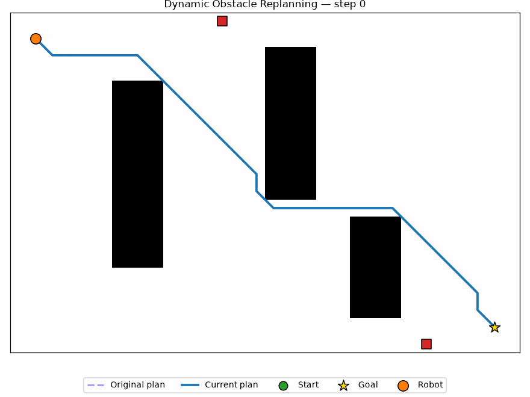
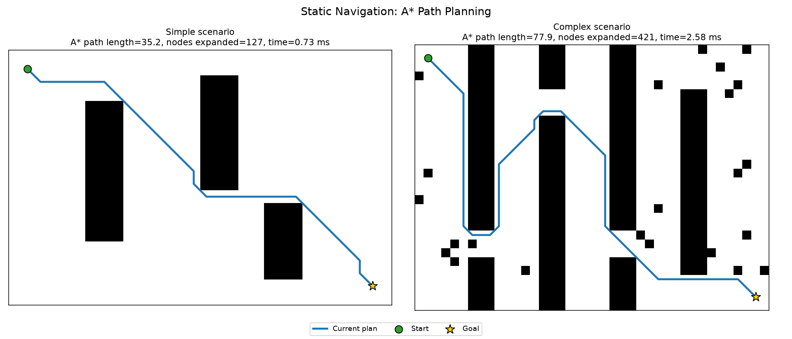
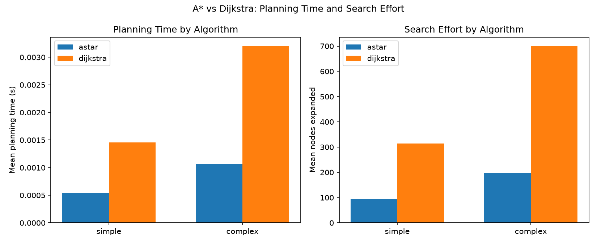

# Dynamic Obstacle-Aware Path Planning for Autonomous Mobile Robots

A Python-based 2D navigation simulator for a grid-world mobile robot. It plans collision-free paths with A* and Dijkstra, drives a simulated robot along them, and detects and replans around obstacles that move into the robot's way.

## Overview

Imagine a warehouse robot with a map of every shelf and wall. It can plan a perfect route from A to B — until another robot, a person, or a forklift crosses its path. A useful navigation stack has to do two things: find a good path through a known map, and notice quickly when that path stops being valid so it can find a new one.

This project implements both halves of that problem on a 2D occupancy grid: static path planning (A* and Dijkstra) and a simulation loop that moves a robot and independently-moving "dynamic obstacles" through time, replanning whenever an obstacle steps onto the robot's route.

## Demo



The dashed line is the robot's original plan; the solid blue line is its current plan. Red squares are dynamic obstacles patrolling fixed routes. When one steps onto the planned path, the robot replans from its current position and continues.

## Motivation

Real environments change after a map is drawn. A fixed path is only safe until something moves into it, so any mobile robot operating around people, vehicles, or other robots needs to (1) plan efficiently over a large search space and (2) detect path invalidation and replan fast enough to stay safe. This project is a from-scratch, dependency-light implementation of that pattern, built to demonstrate the core algorithms and system structure rather than to compete with production stacks like Nav2.

## System Architecture

```
Environment (occupancy grid, static + dynamic obstacles)
        |
Occupancy Grid  (0 = free, 1 = obstacle; scenario JSON or random generation)
        |
Path Planner  (A* / Dijkstra: grid + start + goal -> path)
        |
Robot Controller  (steps cell-by-cell along the current path)
        |
Dynamic Obstacle Monitor  (each tick: move obstacles, check remaining path for collisions)
        |
Replanning  (on collision: snapshot obstacle positions as static, replan from robot's cell)
        |
Metrics / Visualization  (CSV results, comparison plots, animated GIF)
```

Concretely, in code:

```
src/environment.py   -- GridEnvironment, DynamicObstacle
src/planners/        -- astar(), dijkstra() (pure functions: grid+start+goal -> PlanResult)
src/robot.py          -- Robot (position + path-following)
src/simulation.py    -- Simulation (ties env + robot + planner into a step loop, handles replanning)
```

## Features

- 2D occupancy-grid environment with static obstacles (rectangles, individual cells, or random fields) and deterministic seeding
- A* path planning with a configurable heuristic (Manhattan / Euclidean / octile)
- Dijkstra's algorithm as an optimality/efficiency baseline
- 8-connected movement with corner-cutting prevention for physically plausible paths
- Collision checking against both static and dynamic obstacles
- Dynamic obstacles that patrol fixed routes and can block the robot's path
- Automatic path-invalidation detection and replanning mid-simulation
- Benchmarking harness across many randomly generated environments, with results saved to CSV
- Matplotlib visualizations and an animated GIF of a full plan -> block -> replan -> goal episode

## Algorithms

**A\*** explores the grid in order of `f(n) = g(n) + h(n)`, where `g(n)` is the known cost from the start to node `n`, and `h(n)` is a heuristic estimate of the remaining cost to the goal. Here `h` is the *octile distance* (the exact cost of an obstacle-free path on an 8-connected grid). Because the heuristic is admissible (never overestimates), A* is guaranteed to find an optimal path while typically expanding far fewer nodes than an uninformed search, since the heuristic biases exploration toward the goal.

**Dijkstra's algorithm** is the same best-first search with the heuristic set to zero — it expands nodes purely in order of accumulated cost, exploring outward in all directions equally. It is also guaranteed optimal, and is included here specifically as a baseline to show what A*'s heuristic actually buys you (see [Results](#results) below).

Both are implemented from scratch with `heapq` as a binary min-heap priority queue; no external graph/pathfinding library is used.

## Project Structure

```
robot-navigation-simulator/
├── README.md
├── requirements.txt
├── LICENSE
├── .gitignore
├── conftest.py
│
├── src/
│   ├── environment.py       # GridEnvironment, DynamicObstacle
│   ├── robot.py              # Robot: position + path following
│   ├── simulation.py        # Simulation loop + replanning logic
│   ├── planners/
│   │   ├── common.py         # PlanResult, neighbor generation, path length
│   │   ├── astar.py
│   │   └── dijkstra.py
│   └── utils/
│       ├── metrics.py        # TrialResult, CSV export, summary stats
│       └── visualization.py  # matplotlib rendering helpers
│
├── experiments/
│   └── benchmark.py          # Runs trials, writes results.csv + comparison plot
│
├── scripts/
│   ├── run_static_demo.py    # Generates static_navigation.png
│   └── run_dynamic_demo.py   # Runs the dynamic scenario, generates the GIF
│
├── scenarios/
│   ├── simple.json
│   ├── complex.json
│   └── dynamic.json
│
├── results/
│   ├── results.csv
│   ├── static_navigation.png
│   ├── algorithm_comparison.png
│   └── dynamic_replanning.gif
│
└── tests/
    ├── test_environment.py
    ├── test_astar.py
    ├── test_dijkstra.py
    └── test_simulation.py
```

## Installation

```bash
git clone https://github.com/arnavsi05/robot-navigation-simulator.git
cd robot-navigation-simulator
python -m venv .venv
source .venv/Scripts/activate   # on Windows Git Bash / macOS / Linux: .venv/bin/activate
pip install -r requirements.txt
```

## Usage

Run everything from the project root (all commands are run as modules so imports resolve correctly).

**Static navigation demo** (A* on the simple + complex scenarios, saved as a PNG):

```bash
python -m scripts.run_static_demo
```

**Dynamic obstacle + replanning demo** (runs the full simulation, saves a GIF):

```bash
python -m scripts.run_dynamic_demo
```

**Benchmarks** (A* vs Dijkstra across many random environments, plus dynamic-scenario replanning stats):

```bash
python -m experiments.benchmark
```

**Tests:**

```bash
python -m pytest tests/ -v
```

## Results

All numbers below come directly from `results/results.csv`, generated by `python -m experiments.benchmark` (15 trials per condition; static trials use freshly generated, seed-verified-solvable random environments, not the fixed scenario files).

| Scenario | Algorithm | Success rate | Mean planning time | Mean path length | Mean nodes expanded | Mean replans |
|---|---|---|---|---|---|---|
| simple  | astar    | 100% | 0.54 ms | 27.20 | 93.5  | – |
| simple  | dijkstra | 100% | 1.46 ms | 27.20 | 313.7 | – |
| complex | astar    | 100% | 1.06 ms | 49.11 | 197.4 | – |
| complex | dijkstra | 100% | 3.21 ms | 49.11 | 700.8 | – |
| dynamic | astar    | 100% | 1.57 ms (total per episode) | 81.58 | – | 2.4 |

A* and Dijkstra always find paths of **identical length** (both are optimal), but A*'s heuristic cuts search effort dramatically: **~3.4x fewer nodes expanded** on the simple scenario and **~3.6x fewer** on the complex one, translating to roughly a 2.7-3x speedup in wall-clock planning time.

In the dynamic scenario, patrolling obstacles forced an average of **2.4 replanning events per episode**, and the robot still reached the goal in every one of the 15 trials.




## What I Learned

Building this project reinforced a few ideas that are easy to state abstractly but click differently once implemented:

- **Occupancy grids** are a blunt but effective world representation — trivial to reason about and to check collisions against, at the cost of memory that scales with resolution and no notion of continuous space.
- **Graph search vs. heuristic search** is really about where you spend your compute. Dijkstra explores uniformly in all directions; A* spends that same compute biased toward the goal, and the node-expansion counts in my benchmarks make that difference concrete rather than theoretical.
- **Admissibility matters.** I used the octile distance (exact cost on an unobstructed 8-connected grid) specifically because it never overestimates true cost, which is what keeps A*'s result optimal rather than just fast.
- **Collision checking** for a moving obstacle is not the same problem as static collision checking — I ended up "snapshotting" each dynamic obstacle's current cell into the grid at planning time rather than trying to reason about future obstacle positions, which is simpler but has real limitations (see below).
- **Replanning is a systems problem, not just an algorithms problem.** Getting a robot to smoothly recover from an invalidated path required careful state management between the robot's path index, the environment's obstacle positions, and when exactly to trigger a new planning call — most of the subtlety was here, not in the search algorithms themselves.
- **Simulation and evaluation** need to be designed together. Building the benchmarking harness (seeded, solvability-checked random environments; consistent metrics across trials) mattered as much as the planners for producing results I could actually trust.

## Limitations

- The environment is a discretized 2D grid, not a continuous space — the robot's motion is not represented with real kinematics or dynamics.
- The robot moves cell-by-cell with no acceleration/velocity limits, turning radius, or physical footprint beyond a single cell.
- Dynamic obstacles follow simple, predefined patrol routes rather than reactive or learned behavior, and the robot has no way to predict where they will be beyond their current position.
- Replanning uses a "snapshot" of obstacle positions at the moment of replanning rather than forecasting future obstacle motion, so it can react to a blockage but not anticipate one.
- There is no sensor model or sensor noise — the robot has perfect, instantaneous knowledge of the full grid and every obstacle's exact position.
- Not integrated with ROS 2, Gazebo/Isaac Sim, or any physical hardware; this is a self-contained simulation.

## Future Work

- Integrate with **ROS 2** and **Nav2** as a custom global/local planner plugin
- Simulate in **Gazebo** or **Isaac Sim** for physically accurate dynamics and sensor models
- Add sensor-based obstacle detection (simulated lidar/depth) instead of ground-truth obstacle positions
- Add a local planner (e.g., dynamic window approach) for smoother, kinematically-feasible motion between grid-planned waypoints
- Explore more advanced dynamic replanning algorithms (D* Lite, RRT*, time-indexed search) that reason about predicted future obstacle motion
- Port the planner and controller to a real differential-drive robot
